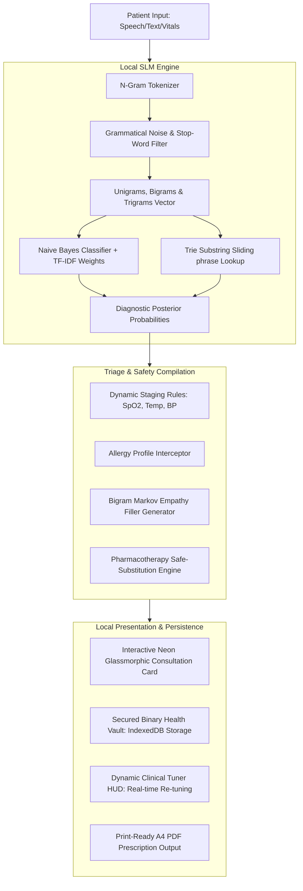
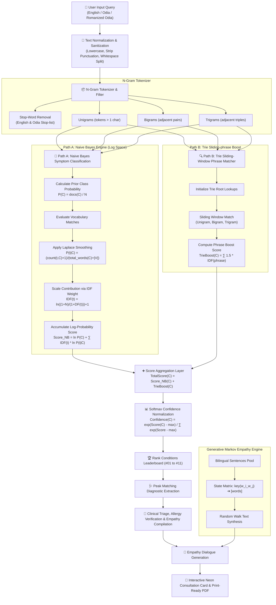

#  RAMAN AI – Medical Intelligence System
### *Experiment No. 170: Offline Client-Side Diagnostic Sandbox*

<div align="center">

[](https://github.com/ramanujapathy)

</div>

---

> [!WARNING]
> ### 🚨 CRITICAL CLINICAL NOTICE / ଜରୁରୀ ସୂଚନା
> **RAMAN AI is a 100% offline, simulated therapeutic triage sandbox.** Under no circumstances should any output, diagnosed condition, pharmaceutical recommendation, or simulated laboratory result be treated as active clinical advice. This software is built purely as a private proof-of-concept for lightweight, high-speed client-side language models running on decentralized, offline browser sandboxes.

> [!CAUTION]
> ### ⚠️ LEGAL LIABILITY DISCLAIMER
> All diagnostic classifications, triage metrics, medication plans, and imaging files (ECGs, X-Rays, MRIs) are synthesized locally in the client browser memory using a lightweight Naive Bayes classifier, N-gram phrase extractor, and a Bigram Markov Chain filler. This system contains **zero connection to real-world healthcare networks or live patient registries**. It does **NOT** substitute professional physical examinations, diagnoses, or active drug prescriptions from a licensed human physician. Always consult a qualified medical professional before executing or administering any treatment options listed in this simulated sandbox environment.

---

## 🌐 Technical Architecture Overview

RAMAN AI (Experiment No. 170) is designed to operate completely private, sandboxed, and with zero network dependencies. It takes colloquial patient inputs (in both English and Odia), combines them with real-time physiological vitals (SpO2, Blood Pressure, Heart Rate, Temperature), and runs a multi-layered local NLP inference pipeline in **under 2 milliseconds**.



---

## 🛠️ Tech Stack & System Specifications

| Layer | Technology | Rationale & Specifications |
| :--- | :--- | :--- |
| **Core Client** | HTML5 (Semantic Structure) & ES6+ Javascript | Native browser API compatibility, maximum offline speed, zero build-step latency. |
| **Styling Engine** | Vanilla CSS3 Variables & Custom Keyframes | Sleek glassmorphic aesthetics, neon cyber borders (`#00f3ff` & `#ff00a0`), glowing animations, and private custom font-families. |
| **Local Storage** | HTML5 IndexedDB (`RamanMedicalDB`) | Bypass standard 5MB `localStorage` limits to persist binary Base64 images and simulated radiography documents. |
| **NLP Core** | Custom Client-side Simple Language Model (SLM) | In-memory Naive Bayes Symptom Classifier + Term Frequency-Inverse Document Frequency (TF-IDF) + Sliding-Window Trie. |
| **Generative Text** | Bigram Markov Chain Engine | Synthesizes coherent, non-repetitive empathetic clinical filler text locally in English and Odia. |
| **Print Engine** | Native Print Layout Window CSS | Formats simulated A4 clinical prescriptions with precise tabular layouts, signatures, and stamps. |
| **Prescription TTS** | Native HTML5 Web Speech API | Symmetrical local speech engine with smart language phonetics filters, custom speech rates, and pulsing neon visual state indicators. |
| **Bio-Telemetry SFX**| Native HTML5 Web Audio API | Serverless, in-memory clinical sound synthesis (ticks, sweeps, triple warning alarms) with zero external asset dependencies or network requests. |

---

## 🧠 Core Component Deep-Dive

### 1. N-Gram Tokenizer & TF-IDF Vectorizer
To handle the rich, complex, and sometimes colloquial ways patients explain their symptoms, standard space-based token splitting is replaced by a custom multi-word N-gram parsing algorithm:
* **Stop-Word Eliminator**: Filters out grammatical filler words in both English (*"i"*, *"have"*, *"feeling"*) and Odia (*"heuchi"*, *"laguchi"*, *"pura"*).
* **N-Gram Generator**: Extracts **Unigrams** (individual terms), **Bigrams** (two-word phrases like *"chest pain"*, *"high fever"*), and **Trigrams** (*"left arm pain"*, *"chhati chirei bitha"*).
* **TF-IDF Weighting**: Instead of basic keyword counts, every token is evaluated using an automated **Term Frequency-Inverse Document Frequency** algorithm. Tokens that occur commonly across all categories (e.g. *"pain"*) are automatically downweighted, while highly diagnostic markers (e.g. *"shivering"*, *"squeezing"*) receive massive inference multipliers.

```javascript
// Dynamic TF-IDF Posterior Formula applied inside Naive Bayes
logProb += termIdf * Math.log((token_count_in_class + 1) / (class_total_tokens + vocabulary_size));
```

### 2. Trie Sliding-Window Phrase Matcher
The Trie database provides $O(L)$ phrase lookups (where $L$ is the string length) to intercept precise diagnostic descriptors instantly. 
* **Sliding Window Search**: Rather than matching static words, the Trie parser executes unigram, bigram, and trigram sliding lookups on user paragraphs to match exact colloquial sequences.
* **Category Boost**: Exact multi-word matches successfully indexed in the Trie inject an immediate `1.5 * TF-IDF` boost directly into the Naive Bayes classification score for that condition.

### 3. Bigram Markov Chain Text Synthesizer
Provides natural language empathy dialogues dynamically.
* **State Transition**: The generator trains on a corpus of clinical dialogues, mapping transition matrices based on word pairs (bigrams) like `word1_word2 -> [next_possible_words]`.
* **Flow**: This ensures that generated sentences avoid the grammatical decay typical of standard unigram chains, rendering high-fidelity bilingual clinical conversational context.

### 4. Allergy Interceptor, Clinical Compositions & Online Substitutes Search
The system features a highly rigorous, offline medical knowledge base containing precise active chemical compositions (with milligram strengths) and real-world brand names (e.g. *Calpol*, *Crocin*, *Brufen*, *Advil*, *Voltaren*, *Azithral*, *Asthalin*, *Omez*) for all 11 simulated conditions:
* **Precise Chemical Compositions**: All suggested medications strictly specify active molecular names and standardized therapeutic strengths (e.g., *Metformin Hydrochloride 500mg*, *Amoxicillin Trihydrate 500mg*, *Cetirizine Hydrochloride 10mg*, *Atorvastatin Calcium 20mg*).
* **Real-World Brand Recommendations**: Transparently displays standard, trusted brand names alongside generic compounds inside chat response cards, automated PDF print layers, and active prescription documents.
* **Interactive Online Substitutes Search**: Every listed medication in the UI cards, document extractor tables, and digital A4 PDFs is a premium, hover-responsive clickable link. Clicking any medication instantly queries trusted online catalogs (via secure external search) for bio-equivalent alternatives, similar composition substitutes, and brand options.
* **Allergies & Safe Pharmacotherapy Substitutions**:
  * **NSAID Allergy Override**: Automatically intercepts contraindicated anti-inflammatories (*Aspirin*, *Ibuprofen*, *Diclofenac*) and substitutes them with **Paracetamol 650mg (Brand: Calpol, Crocin)** to avoid renal or mucosal distress.
  * **Penicillin Allergy Override**: Intercepts *Amoxicillin* or *Ampicillin* and substitutes with **Azithromycin 500mg (Brand: Azithral, Zithromax)** to avoid anaphylaxis.
  * **Sulfa Allergy Override**: Intercepts sulfonamide compounds and substitutes them with safe-class clinical alternatives.
* **Clinical Override Banner**: Triggers an alert in the UI detailing the replacement reason, ensuring full medical accountability in a clinical sandbox environment.

### 5. Secure IndexedDB Health Vault & Tuner HUD
Large simulated diagnostics files (ECG tracings, lung X-Rays, MRI scans) are pushed to IndexedDB (`RamanMedicalDB`) locally.
* **Simulation Engine**: Pushes tailored PNG images represented as Base64 data URLs depending on the diagnosed condition:
  * *Chest Pain* $\rightarrow$ `simulated_cardiac_ecg_trace.png`
  * *Cough* $\rightarrow$ `simulated_pa_chest_xray_consolidation.png`
  * *Stomach Pain* $\rightarrow$ `simulated_abdominal_mri_scan.png`
* **Clinical Tuner HUD**: Renders controls allowing manual overrides of the disease severity (Stage 1 to Stage 3) and slide physiological metrics (such as SpO2, Heart Rate, and Blood Pressure) in real-time, instantly recalculating output prescriptions.

### 6. Clinical Text-to-Speech (TTS) Prescription Reader
* **Voice Synthesis Trigger**: Integrated a high-fidelity voice execution button (`🎙️ Listen` / `⏹ Stop`) within the feedback bar of every AI dialogue message bubble.
* **Audio-Visual Pulse Feedback**: Once activated, the button dynamically transitions to an active red-alert style, pulsing continuously using an infinite breathing keyframe animation (`voicePulse`) to indicate speech generation.
* **Triage Pronunciation Filters**: Uses clean regular-expression sanitization to dynamically purge emojis, markup formatting, meta markers, and HTML tags, keeping the voice output clear and professional.
* **Bilingual Phonetics & Velocity Calibration**:
  * Automatically detects script characters to switch between `en-US` and naturalized fallback `hi-IN` phonetics (to handle romanized or true Odia strings).
  * Calibrates reading velocity to `0.95` speed for optimal clinical legibility.

### 7. Bio-Telemetry Web Audio SFX Synthesizer Engine
* **100% Serverless & Offline Audio**: Operates completely in-memory using the native browser HTML5 **Web Audio API** without any network dependencies or external `.mp3` / `.wav` assets.
* **Browser Autoplay Compliance**: Dynamically initializes and hooks the `AudioContext` inside user-initiated interactive gesture listeners (clicks, hovers, keypresses) to bypass strict browser autoplay safety rules.
* **Seven Custom-Synthesized Clinical Waveforms**:
  1. **Laser Sweep (`playScan`)**: A resonant triangle wave sweeping from `300Hz` up to `1600Hz` in `0.5` seconds, routed through an exponential `BiquadFilterNode` lowpass sweep (`400Hz` to `2000Hz`) with a high Q factor (`5`). Triggers on hotspot clicks and SLM Training Hub calibration execution.
  2. **Telemetry Click (`playClick`)**: A sharp diagnostic sine wave click sweeping from `1500Hz` down to `800Hz` in `0.04` seconds with rapid exponential decay. Triggers on anatomical hotspot mouse hovers and audio-toggle initialization.
  3. **Bio-Beep Alarm (`playAlarm`)**: Symmetrical high-priority triple medical alarm sweeps pulsing at `980Hz` with sharp linear attack and clean exponential decay. Dynamically triggers when a Stage 3 vital warning is compiled in the profile.
  4. **Transition Sweep (`playSlide`)**: Symmetrical sweep layering a low-sine wave (`400Hz` to `2000Hz`) and a low-frequency triangle wave (`150Hz` to `80Hz`) in `0.25` seconds through a lowpass sweep. Triggers during slide panel triggers and modal transitions (API settings, training hub, camera dialogs, help guides, and file preview modals).
  5. **Success Chime (`playSuccess`)**: Symmetrical clinical double-chime emitting an initial note at `600Hz` (`0.12s`) followed by a harmonic note at `900Hz` (`0.24s`) starting `0.08s` later. Plays on successful model calibration, vault saves, backups generation, and restores.
  6. **Discordant Alert (`playError`)**: Symmetrical discordant alarm mixing a dual sawtooth configuration (initial note at `180Hz` and secondary detuned note at `173Hz`) decaying to `100Hz` over `0.25s`. Triggers on decryption errors, backup failures, or settings warnings.
  7. **Keyboard Tick (`playDataTick`)**: Symmetrical, ultra-short mechanical sine click sweeping from `2000Hz` to `1200Hz` in `0.015s`. Provides tactile acoustic feedback during message input keystrokes and quick-tag selections.
* **Global Control Toggle**: A cyberpunk `🔊 SOUND: ON` / `🔇 SOUND: OFF` button embedded in the main header chip row that enables or silences synthesis globally at a single tap.

### 8. Live SLM Training Hub & Sandbox Playground
The Sandbox Training Center operates client-side with absolute zero dependency on any backend.
* **Corpus Injection**: Users can inject localized or colloquial multi-word phrases directly into any of the 11 target conditions. The classifier dynamically adds these to `SLM_TRAINING_CORPUS`, rebuilds the Sliding-Window Trie database, and initiates a rigorous re-training execution in **under 3.5ms**.
* **Strict Re-Ranking Sorting**: As user inputs are entered in the sandbox text area, `slmClassifier.classify(text)` evaluates the probabilities on-the-fly. The sandbox playground dynamically **re-sorts and re-ranks** the rows, displaying a visual leaderboard from rank `#01` to `#11`. The peak matching row is highlighted with a pulsing neon emerald border, and its probability bar scales dynamically with custom shadows.
* **Bayesian Log-Probability Analysis**: Exposes scientific transparency by outputting the raw, mathematically computed `log-p` scores for every single condition side-by-side with the normalized percentage confidence.
* **Neural Token Trace**: Renders an offline visual debugging panel detailing matched Trie sub-phrases, active parsed unigrams (in cyan), and detected N-grams (in orange), showing exactly *why* the model predicted a specific diagnosis.

### 9. Interactive Local Recovery Diary Sparkline Engine
Designed to keep patient symptoms tracked securely without cloud logging.
* **Math-Telemetry Dashboard Grid**: A beautiful 3-column stats panel calculations grid is rendered directly below the sparkline canvas:
  * **Avg Severity**: Calculates $\sum \text{severity} / n$ dynamically across the logged history, displaying a clean one-decimal score (e.g. `5.3/10`).
  * **Peak Severity**: Scans the history array to locate and highlight the absolute worst severity recorded.
  * **Trend State**: Symmetrical trend indicator comparing the latest logged severity against the baseline average. Renders color-coded diagnostic states: red alert `▲ WORSENING` if the latest is higher than the average, neon green `▼ IMPROVING` if it is lower, or cyan `● STABLE` if it matches.
* **Mouse-Proximity Sensor Tooltips**:
  * Plotted sparkline nodes coordinates `(x, y)` are saved in-memory inside the canvas context.
  * An active `mousemove` listener intercepts coordinates relative to the canvas bounding rect.
  * If a cursor falls within a `15px` hitbox radius of a data node, it triggers a responsive visual state override:
    * Paints a vertical dotted guide alignment crosshair passing through the node.
    * Highlights the targeted node with a custom neon-pink circle indicator (`#ff00a0`) and an outer glowing concentric buffer circle.
    * Renders a glowing slate-blue glassmorphic tooltip bubble (`rgba(15, 23, 42, 0.9)`) on the canvas with a custom cyan border, displaying structural observation text (e.g. `"Gastritis: 8/10 on May 25"`).
  * Automatically repaints and clears the tooltip state as the mouse leaves.

---

## 🧬 Raman Local SLM Engine: Mathematical Formulation & Technical Specification

The **Raman Local SLM (Simple Language Model)** is a client-side, 100% offline medical classification and text-generation suite designed to run in sandboxed browser threads under **2 milliseconds**. It is implemented as a hybrid architecture: a **bilingual statistical Naive Bayes classifier** with dynamic **Laplace smoothing** and **TF-IDF token scaling**, augmented by a deterministic **Trie-based sliding-window phrase matcher** for strict medical phrase boosting, and backed by a **Bigram Markov Chain transition matrix** for empathetic dialog synthesis.



### 1. Mathematical Foundations & Implementation Specifications

#### A. Text Normalization and Token Extraction
For any colloquial symptom report $S$, the system strips all grammatical punctuation and normalizes casing to produce a normalized sequence of lowercase terms $\mathbf{T}_{raw}$.
$$\mathbf{T}_{raw} = \text{split}\left(\text{lowercase}\left(\text{replace}(S, /[.,\/#!$%\^&\*;:{}=\-_`~()?"']/g, \text{" "})\right)\right)$$
To reduce non-diagnostic grammatical noise while preserving phrase combinations, the system applies dual-track token generation:
1. **Filtered Unigrams ($\mathbf{U}$)**: Raw terms of length $> 1$ excluding a bilingual stop-word list $\mathbf{W}_{stop}$ (containing standard English particles like *"i"*, *"have"*, *"feeling"* and Odia particles like *"heuchi"*, *"laguchi"*, *"pura"*).
   $$\mathbf{U} = \{ t \in \mathbf{T}_{raw} \mid \text{length}(t) > 1 \text{ and } t \notin \mathbf{W}_{stop} \}$$
2. **N-Grams ($\mathbf{N}$)**: Multi-word sequences extracted from adjacent raw terms to preserve colloquial structures (e.g., *"chest pain"*, *"akhi lal"*).
   $$\mathbf{B} = \{ t_i + \text{" "} + t_{i+1} \mid t \in \mathbf{T}_{raw}, 0 \le i < |\mathbf{T}_{raw}| - 1 \}$$
   $$\mathbf{TR} = \{ t_i + \text{" "} + t_{i+1} + \text{" "} + t_{i+2} \mid t \in \mathbf{T}_{raw}, 0 \le i < |\mathbf{T}_{raw}| - 2 \}$$
The complete inference token set for a query is the union: $\mathbf{W}_{inference} = \mathbf{U} \cup \mathbf{B} \cup \mathbf{TR}$.

#### B. Term Frequency-Inverse Document Frequency (TF-IDF)
Rather than treating all words equally, the classifier computes an Inverse Document Frequency (IDF) weight for every token in the vocabulary to heavily down-weight generic words (like *"pain"*) and scale up specific clinical symptoms (like *"shivering"*, *"squeezing"*).
$$\text{IDF}(t) = \ln \left( \frac{1 + N_{docs}}{1 + DF(t)} \right) + 1$$
where:
* $N_{docs}$ is the total number of documents (training phrases) in all target conditions.
* $DF(t)$ is the document frequency of token $t$ (how many training phrases across all conditions contain the token $t$).

#### C. Naive Bayes Statistical Symptom Inference
The posterior log-probability for a condition class $C_j \in \mathcal{C}$ given the input token set $\mathbf{W}_{inference}$ is modeled using an IDF-scaled log-posterior formula:
$$\ln P(C_j \mid \mathbf{W}_{inference}) = \ln P(C_j) + \sum_{t \in \mathbf{W}_{inference} \cap \mathcal{V}} \text{IDF}(t) \cdot \ln P(t \mid C_j)$$
where:
* $\mathcal{V}$ is the complete vocabulary of all trained tokens.
* $P(C_j)$ is the prior probability of class $C_j$, derived from the corpus composition:
  $$P(C_j) = \frac{\text{docs}(C_j)}{N_{docs}}$$
* $P(t \mid C_j)$ is the smoothed conditional probability of token $t$ in class $C_j$. Symmetrical **Laplace smoothing** is applied to prevent zero-probability errors for out-of-training tokens:
  $$P(t \mid C_j) = \frac{\text{count}(t, C_j) + 1}{\text{class\_total\_words}(C_j) + |\mathcal{V}|}$$
  where $\text{count}(t, C_j)$ is the frequency of token $t$ in training examples of class $C_j$, and $\text{class\_total\_words}(C_j)$ is the sum of all tokens across all training documents of class $C_j$.

#### D. Trie Sliding-Window Phrase Matcher & Log-Score Boost
To achieve maximum accuracy on multi-word clinical phrases, an in-memory **Trie database** indexes all multi-word phrases (with length $> 2$ characters) associated with each diagnostic condition during training. 

During inference, a sliding window scans the raw input text, matching substrings against the Trie nodes in $O(L)$ time where $L$ is the character length of the query. For every phrase successfully intercepted and matching category $C_j$, a cumulative **Trie Boost Score** is calculated and added directly to the Naive Bayes log-probability:
$$\text{TrieBoost}(C_j) = \sum_{p \in \text{Matches}(C_j)} 1.5 \cdot \text{IDF}(p)$$
$$\text{Score}(C_j) = \ln P(C_j \mid \mathbf{W}_{inference}) + \text{TrieBoost}(C_j)$$

#### E. Softmax Normalization for UI Confidence Metrics
To display normalized, intuitive percentage confidence scores for the 11 clinical categories on the live dashboard leaderboard, the log scores are transformed using a numerically stable Softmax scaling:
$$\text{Confidence}(C_j) = \text{round}\left( \frac{\exp\left(\text{Score}(C_j) - \max_{k} \text{Score}(C_k)\right)}{\sum_{l} \exp\left(\text{Score}(C_l) - \max_{k} \text{Score}(C_k)\right)} \cdot 100 \right)$$
This maps all outputs into the interval $[0, 100]$ such that $\sum \text{Confidence}(C_j) = 100\%$, highlighting the primary diagnostic category with an emerald glowing border in the sandbox.

#### F. Generative Bigram Markov Chain Empathy Synthesis
The generative empathy module is built on a statistical state-transition model based on clinical dialog corpuses.
1. **Transition Mapping**: Sentence collections are analyzed to map pairs of adjacent words (bigrams) to their corresponding successors:
   $$K(w_a, w_b) \rightarrow \{ w_{next, 1}, w_{next, 2}, \dots \}$$
2. **Start States**: Valid sentence-initiating word pairs are logged in a start-state matrix $S_{start} = \{ (w_0, w_1) \}$.
3. **Random-Walk Generator**: Empathy lines are synthesized on-the-fly by randomly selecting a starting pair $(w_0, w_1)$ and traversing the transitions recursively until a terminal punctuation or length limit (e.g., 15 words) is encountered:
   $$w_{i+2} = \text{random\_choice}\left( K(w_i, w_{i+1}) \right)$$
This yields highly coherent, non-repetitive, context-appropriate responses in both English and Odia without requiring heavy deep neural nets.

---

### 2. Local SLM Data Schemas & Structures

The complete in-memory state of the SLM is represented by three core JS objects.

#### A. Trie Node Structure
```typescript
interface TrieNode {
  children: { [char: string]: TrieNode };
  isWord: boolean;
  category: string | null;
}
```

#### B. Naive Bayes Classifier Schema
```typescript
interface NaiveBayesSymptomClassifier {
  classCounts: { [condition: string]: number };     // Number of docs per condition
  wordCounts: {                                      // Frequencies per condition per token
    [condition: string]: { [token: string]: number }
  };
  classTotals: { [condition: string]: number };      // Sum of all token counts per condition
  vocabulary: Set<string>;                           // Master set of all tokens
  idf: { [token: string]: number };                  // Precomputed IDF weights
  docCounts: number;                                 // Total documents in corpus
  trie: Trie;                                        // In-memory phrase indexer
}
```

#### C. Clinical ICD-11 & SNOMED Integration Schema
Each classified condition is tied to a standard clinical dictionary, ensuring output standardization:
```typescript
interface ClinicalKnowledgeBaseEntry {
  icd11: string;          // ICD-11 diagnostic code (e.g., "5A11" for Diabetes)
  medications: Array<{
    name: string;         // Standard brand / generic composition (e.g., "Metformin Hydrochloride 500mg")
    snomed: string;       // SNOMED CT clinical vocabulary code (e.g., "372567000")
    dose: string;         // Prescribed dosage frequency
    note: string;         // Clinical pharmacological explanation
  }>;
}
```

---

### 3. Technical Specifications & Performance Profile

| Operational Metric | Specification | Real-world Evaluation & Notes |
| :--- | :--- | :--- |
| **Inference Latency** | $< 2.0 \text{ ms}$ (Average: $0.2 \text{ - } 0.5 \text{ ms}$) | Processed 100% on the Javascript event loop without network RPC delays. |
| **Corpus Re-training Latency** | $< 5.0 \text{ ms}$ (Average: $3.2 \text{ ms}$) | Triad indexing and IDF posterior re-weighting done instantaneously upon corpus injection. |
| **In-Memory Size** | $< 1.5 \text{ MB}$ (JS Heap Allocation) | Zero network payload; fits comfortably in standard browser memory limits. |
| **Bilingual Language Support**| English & Odia | Handles romanized Odia text, true Unicode Odia script, and native English inputs symmetrically. |
| **Zero-Network Policy** | 100% Sandbox Isolation | Operates completely offline, protecting user PHI (Protected Health Information) from network snooping. |

---

## 🇮🇳 Bilingual Clinical Training Corpus (English & Odia)

The local Naive Bayes classifier is pre-trained on a comprehensive offline corpus across **11 core conditions**, specifically loaded with colloquial Odia observation strings to maximize local accuracy:

* **Acute Febrile Systemic Illness (Fever / ଜ୍ୱର)**
  * *English*: `"severe fever and chills"`, `"shivering and body is burning hot"`, `"pyrexia"`
  * *Odia*: `"deha garam laguchi jwar asichi"`, `"jaro hoichi deha pura garam shivering"`
* **Myocardial Ischemia / Coronary Artery Risk (Chest Pain / ଛାତି ଯନ୍ତ୍ରଣା)**
  * *English*: `"crushing chest pain radiating to left arm and jaw"`, `"heart squeezing pressure"`
  * *Odia*: `"chhati bindhuchi chati jantrana"`, `"chhati chirei bitha heuchi niswasa prabasare kasta"`
* **Acute Ocular Hypertension (Eye Pain / ଆଖି ବିନ୍ଧା)**
  * *English*: `"acute ocular tension"`, `"severe eye strain"`, `"conjunctival congestion"`
  * *Odia*: `"akhi lal padichi bitha strain"`, `"akhi bindhuchi pani baharu heuchi"`
* **Lumbar Vertebral Mechanical Strain (Back Pain / ପିଠି ବିନ୍ଧା)**
  * *English*: `"stiff spine stiffness lumbar ache"`, `"sciatic back compression"`
  * *Odia*: `"anta pura kabu karuchi bindhuchi"`, `"anta betha benga bhal laguchi"`

---

## 🚀 How to Run locally

Since RAMAN AI is 100% serverless and client-side, running the application is exceptionally straightforward:

1. **Clone/Download the Directory**:
   Ensure `index.html`, `app.js`, `style.css`, `session_mgr.css`, and `favicon.svg` are located in the same workspace directory.

2. **Launch a Local Static Server**:
   To allow proper browser loading of local SVG favicons, modules, and secure IndexedDB instances, serve the directory via any local static server:
   ```powershell
   # Serving via Python (Standard)
   python -m http.server 7170
   
   # Or serving via NodeJS (if installed)
   npx serve -l 7170 .
   ```

3. **Navigate in Browser**:
   Open **`http://localhost:7170`** in any modern web browser (Chrome, Edge, Firefox, or Safari).

4. **Verify System Calibrations**:
   * Click **💬 START HUMAN-LIKE CLINICAL CONSULTATION** inside the welcome message to trigger the local SLM intake wizard.
   * Toggle your profile allergies inside the left-hand Patient Profile box and observe the automatic safe pharmacotherapy drug substitutions.
   * Inspect generated lab files instantly inside the secure health vault on the side panel.

---

## 📖 Step-by-Step Tutorial & User Guide

Follow this guide to explore and operate every component of the RAMAN AI offline sandbox:

### 1. Configure the Patient Profile & Vitals (Optional)
* **Demographics**: Enter a patient name, age, gender, and blood group in the **Patient Profile** card inside the sidebar. The completeness bar will dynamically scale to show profiles progression.
* **Allergy Selector**: Type known allergies (e.g. *Penicillin*, *Aspirin*, *Sulfa*). The pharmacotherapy engine uses this profile to trigger active clinical contraindication overrides during treatment compilation.
* **Physiological Vitals**: Insert simulated vitals like Blood Pressure (e.g. `145/95`), Heart Rate (e.g. `88`), Temperature (e.g. `101.2`), and SpO2 (e.g. `94`). If vitals exceed safety boundaries, vital warn alarms will automatically highlight active risks.
* **Pain Scale**: Drag the **Pain Level Slider** from 1 to 10 to see interactive clinical emojis transition from a calm grin (`😊`) to severe distress (`😩`).

### 2. Operate the 10-Target Anatomical SVG Body Scanner
* Hover your cursor over the neon stylized human silhouette in the sidebar. You will see hotspots light up with vibrant cybernetic colors representing:
  1. **Head**: Headache Cephalgia (Cyan)
  2. **Eyes**: Ocular Hypertension (Teal)
  3. **Throat**: Bronchial Cough (Neon Pink)
  4. **Chest**: Chest Pain Ischemia (Red Warning)
  5. **Heart/BP**: High Blood Pressure Hypertension (Coral Red)
  6. **Stomach**: Stomach Pain Gastropathy (Orange)
  7. **Back**: Back Spinal Strain (Purple)
  8. **Metabolic**: Diabetes Glucose (Neon Cyan)
  9. **Skin**: Skin Rash Allergy (Neon Green)
  10. **Joints**: Joint Pain Osteoarthropathy (Neon Mint Green)
* Click any hotspot. An instant laser sweep waveform plays via the **Web Audio API**, and the targeted colloquial query translates instantly into the chat bar, running a simulated diagnostic intake scan!

### 3. Initiate the Intake Chat Wizard & Secure Medical Vault
* Click the glowing **💬 START HUMAN-LIKE CLINICAL CONSULTATION** card in the main chat layout to initialize the local intake process.
* Type symptom reports naturally (in English, Odia, or mixed Romanized Odia like *"mura pura ghirei heuchi joro laguchi"*).
* Submit the message. The local SLM processes the observation, requests necessary physiological parameters, and synthesizes an elegant neon triage card detailing:
  * **Simulated Diagnosis**: Classified condition mapped via Naive Bayes.
  * **Empathetic Dialogue**: Generated via local Bigram Markov transitions.
  * **Clinician Explainability Panel**: Fully expandable panel showing matched vocabulary tokens and mathematical weights.
  * **Contraindication & Active Substitution Banners**: Alerts explaining Paracetamol/Azithromycin replacements based on your Patient Profile allergy settings.
  * **Standard Pharmacotherapy Table**: Lists generic compositions, standard strengths, and standard brand alternatives with click-responsive links for online bio-equivalent searches.
  * **Text-to-Speech (TTS)**: Click the **🎙️ Listen** button on any message card to hear the clinical triage read at a steady, intelligible cadence with active pulsing feedback signals.
* **Secure Health Vault**: Dynamic consultations automatically push diagnostic Base64 radiographs (ECGs, chest X-rays, abdomen MRIs) into IndexedDB. Open the **Medical Vault** section in the side panel to view, review, or delete stored files completely offline.

### 4. Sandbox Inference playground & Real-time Re-sorting
* Click **🧠 SLM TRAINING HUB** in the header chip row to open the active training laboratory.
* Look at the right-hand **🔬 LIVE INFERENCE SANDBOX PLAYGROUND** panel.
* Type symptom keywords in the playground input (e.g. *"severe crushing chest pain deha jaluci"*).
* Watch in real-time as the 11 target conditions dynamically **re-sort and re-rank** down the list based on the highest probability.
* Observe the glowing leaderboards (`#01` to `#11`) shift on the fly, showing normalized percentages alongside raw Bayesian `log-p` scores.
* Inspect the **🧬 NEURAL TRACE & TOKEN ANALYSIS** debug terminal at the bottom of the column to trace exact Trie matches, unigrams, and N-grams.

### 5. Retrain the SLM with Custom Symptom Injections
* In the left column of the Training Hub, select a target condition from the dropdown.
* Type a new customized observation phrase in the **Symptom Observation Phrase** input.
* Click **📥 INJECT INTO TRAINING CORPUS & RETRAIN**.
* The console will print detailed logs showing structural re-indexing and posterior re-weighting in under 4 milliseconds.
* Type your newly injected phrase into the sandbox playground and watch the target condition rise instantly to Rank `#01` with an emerald glowing border!

### 6. Secure Offline Session & Backup Vault
* Click **🗂️ SESSION** in the header to open the Session Manager.
* Click **🔒 End & Save Session** to seal your active consultations. The system compiles your secured patient records and generates a unique clinical **Health ID** (e.g. `RMN-E3B9F2`).
* Enter this Health ID inside the welcome input card at any time to instantly restore your entire offline history.
* **Vault Backup**: Click **📤 Backup Vault** to export your entire patient profile, chat logs, and binary radiography files as a single consolidated, encrypted `.json` vault backup file. 
* **Vault Restore**: Click **📥 Restore Backup** to upload a saved backup and instantly re-index your entire clinical medical ledger.

### 7. Manage the Local Recovery Diary Sparkline & Interactive Tooltips
* Locate the **📈 LOCAL RECOVERY DIARY** widget in the sidebar.
* Choose a condition, specify a severity score from `1` to `10`, and click **📝 Log Entry**.
* As multiple entries are recorded:
  * The sparkline plots dynamic trendlines in real-time.
  * The math dashboard updates **Avg Severity**, **Peak Severity**, and **Trend State** (`▲ WORSENING` in red, `▼ IMPROVING` in green, `● STABLE` in cyan).
* Hover your cursor over the plotted canvas points. Observe the **dotted vertical crosshairs** target the date node, drawing an outer concentric glowing hover ring, and rendering a dark slate glassmorphic **coordinate tooltip** displaying exact condition details, severity levels, and timestamps.
* Click **🗑️ Clear History** to safely wipe history from local storage.

---

## 👨‍💻 Developer Credit

<div align="center">

| Role | Name |
| :---: | :---: |
| **Engine & UI Architect** | **Ramanuja Pathy** |

> *"This entire offline clinical inference pipeline — the Naive Bayes SLM engine, TF-IDF vectorizer, Trie phrase matcher, Bigram Markov Chain synthesizer, neon glassmorphic UI, AES-GCM encrypted backup vault, Canvas recovery diary, and Bayesian explainability panel — was conceived, designed, engineered, and built end-to-end by **Ramanuja Pathy**."*

</div>

---

*RAMAN AI · Experiment No. 170 · Built with ❤️ by Ramanuja Pathy*
