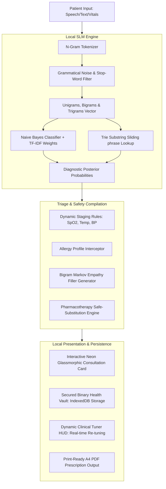

#  RAMAN AI – Medical Intelligence System
### *Experiment No. 170: Offline Client-Side Diagnostic Sandbox*

<div align="center">

[](https://github.com/ramanujapathy)

</div>

---

> [!WARNING]
> ### 🚨 CRITICAL CLINICAL NOTICE / ଜରୁରୀ ସୂଚନା
> **RAMAN AI is a 100% offline, simulated virtual healthcare triage sandbox.** Under no circumstances should any output, diagnosed condition, pharmaceutical recommendation, or simulated laboratory result be treated as active clinical advice. This software is built purely as a private proof-of-concept for lightweight, high-speed client-side language models running on decentralized, offline browser sandboxes.

> [!CAUTION]
> ### ⚠️ LEGAL LIABILITY DISCLAIMER
> All diagnostic classifications, triage metrics, medication plans, and imaging files (ECGs, X-Rays, MRIs) are synthesized locally in the client browser memory using a lightweight Naive Bayes classifier, N-gram phrase extractor, and a Bigram Markov Chain filler. This system contains **zero connection to real-world healthcare networks or live patient registries**. It does **NOT** substitute professional physical examinations, diagnoses, or active drug prescriptions from a licensed human physician. Always consult a qualified medical professional before executing or administering any treatment options listed in this simulated sandbox environment.

---

## 🌐 Technical Architecture Overview

RAMAN AI (Experiment No. 170) is designed to operate completely private, sandboxed, and with zero network dependencies. It takes colloquial patient inputs (in both English and Odia), combines them with real-time physiological vitals (SpO2, Blood Pressure, Heart Rate, Temperature), and runs a multi-layered local NLP inference pipeline in **under 2 milliseconds**.



---

## 🛠️ Tech Stack & System Specifications

| Layer | Technology | Rationale & Specifications |
| :--- | :--- | :--- |
| **Core Client** | HTML5 (Semantic Structure) & ES6+ Javascript | Native browser API compatibility, maximum offline speed, zero build-step latency. |
| **Styling Engine** | Vanilla CSS3 Variables & Custom Keyframes | Sleek glassmorphic aesthetics, neon cyber borders (`#00f3ff` & `#ff00a0`), glowing animations, and private custom font-families. |
| **Local Storage** | HTML5 IndexedDB (`RamanMedicalDB`) | Bypass standard 5MB `localStorage` limits to persist binary Base64 images and simulated radiography documents. |
| **NLP Core** | Custom Client-side Simple Language Model (SLM) | In-memory Naive Bayes Symptom Classifier + Term Frequency-Inverse Document Frequency (TF-IDF) + Sliding-Window Trie. |
| **Generative Text** | Bigram Markov Chain Engine | Synthesizes coherent, non-repetitive empathetic clinical filler text locally in English and Odia. |
| **Print Engine** | Native Print Layout Window CSS | Formats virtual A4 clinical prescriptions with precise tabular layouts, signatures, and stamps. |
| **Prescription TTS** | Native HTML5 Web Speech API | Symmetrical local speech engine with smart language phonetics filters, custom speech rates, and pulsing neon visual state indicators. |
| **Bio-Telemetry SFX**| Native HTML5 Web Audio API | Serverless, in-memory clinical sound synthesis (ticks, sweeps, triple warning alarms) with zero external asset dependencies or network requests. |

---

## 🧠 Core Component Deep-Dive

### 1. N-Gram Tokenizer & TF-IDF Vectorizer
To handle the rich, complex, and sometimes colloquial ways patients explain their symptoms, standard space-based token splitting is replaced by a custom multi-word N-gram parsing algorithm:
* **Stop-Word Eliminator**: Filters out grammatical filler words in both English (*"i"*, *"have"*, *"feeling"*) and Odia (*"heuchi"*, *"laguchi"*, *"pura"*).
* **N-Gram Generator**: Extracts **Unigrams** (individual terms), **Bigrams** (two-word phrases like *"chest pain"*, *"high fever"*), and **Trigrams** (*"left arm pain"*, *"chhati chirei bitha"*).
* **TF-IDF Weighting**: Instead of basic keyword counts, every token is evaluated using an automated **Term Frequency-Inverse Document Frequency** algorithm. Tokens that occur commonly across all categories (e.g. *"pain"*) are automatically downweighted, while highly diagnostic markers (e.g. *"shivering"*, *"squeezing"*) receive massive inference multipliers.

```javascript
// Dynamic TF-IDF Posterior Formula applied inside Naive Bayes
logProb += termIdf * Math.log((token_count_in_class + 1) / (class_total_tokens + vocabulary_size));
```

### 2. Trie Sliding-Window Phrase Matcher
The Trie database provides $O(L)$ phrase lookups (where $L$ is the string length) to intercept precise diagnostic descriptors instantly. 
* **Sliding Window Search**: Rather than matching static words, the Trie parser executes unigram, bigram, and trigram sliding lookups on user paragraphs to match exact colloquial sequences.
* **Category Boost**: Exact multi-word matches successfully indexed in the Trie inject an immediate `1.5 * TF-IDF` boost directly into the Naive Bayes classification score for that condition.

### 3. Bigram Markov Chain Text Synthesizer
Provides natural language empathy dialogues dynamically.
* **State Transition**: The generator trains on a corpus of clinical dialogues, mapping transition matrices based on word pairs (bigrams) like `word1_word2 -> [next_possible_words]`.
* **Flow**: This ensures that generated sentences avoid the grammatical decay typical of standard unigram chains, rendering high-fidelity bilingual clinical conversational context.

### 4. Allergy Interceptor, Clinical Compositions & Brand Suggestions
The system features a highly rigorous, offline medical knowledge base containing precise active chemical compositions (with milligram strengths) and real-world brand names (e.g. *Calpol*, *Crocin*, *Brufen*, *Advil*, *Voltaren*, *Azithral*, *Asthalin*, *Omez*) for all 11 simulated conditions:
* **Precise Chemical Compositions**: All suggested medications strictly specify active molecular names and standardized therapeutic strengths (e.g., *Metformin Hydrochloride 500mg*, *Amoxicillin Trihydrate 500mg*, *Cetirizine Hydrochloride 10mg*, *Atorvastatin Calcium 20mg*).
* **Real-World Brand Recommendations**: Transparently displays standard, trusted brand names alongside generic compounds inside chat response cards, automated PDF print layers, and active prescription documents.
* **Allergies & Safe Pharmacotherapy Substitutions**:
  * **NSAID Allergy Override**: Automatically intercepts contraindicated anti-inflammatories (*Aspirin*, *Ibuprofen*, *Diclofenac*) and substitutes them with **Paracetamol 650mg (Brand: Calpol, Crocin)** to avoid renal or mucosal distress.
  * **Penicillin Allergy Override**: Intercepts *Amoxicillin* or *Ampicillin* and substitutes with **Azithromycin 500mg (Brand: Azithral, Zithromax)** to avoid anaphylaxis.
  * **Sulfa Allergy Override**: Intercepts sulfonamide compounds and substitutes them with safe-class clinical alternatives.
* **Clinical Override Banner**: Triggers an alert in the UI detailing the replacement reason, ensuring full medical accountability in a clinical sandbox environment.

### 5. Secure IndexedDB Health Vault & Tuner HUD
Large simulated diagnostics files (ECG tracings, lung X-Rays, MRI scans) are pushed to IndexedDB (`RamanMedicalDB`) locally.
* **Simulation Engine**: Pushes tailored PNG images represented as Base64 data URLs depending on the diagnosed condition:
  * *Chest Pain* $\rightarrow$ `simulated_cardiac_ecg_trace.png`
  * *Cough* $\rightarrow$ `simulated_pa_chest_xray_consolidation.png`
  * *Stomach Pain* $\rightarrow$ `simulated_abdominal_mri_scan.png`
* **Clinical Tuner HUD**: Renders controls allowing manual overrides of the disease severity (Stage 1 to Stage 3) and slide physiological metrics (such as SpO2, Heart Rate, and Blood Pressure) in real-time, instantly recalculating output prescriptions.

### 6. Clinical Text-to-Speech (TTS) Prescription Reader
* **Voice Synthesis Trigger**: Integrated a high-fidelity voice execution button (`🎙️ Listen` / `⏹ Stop`) within the feedback bar of every AI dialogue message bubble.
* **Audio-Visual Pulse Feedback**: Once activated, the button dynamically transitions to an active red-alert style, pulsing continuously using an infinite breathing keyframe animation (`voicePulse`) to indicate speech generation.
* **Triage Pronunciation Filters**: Uses clean regular-expression sanitization to dynamically purge emojis, markup formatting, meta markers, and HTML tags, keeping the voice output clear and professional.
* **Bilingual Phonetics & Velocity Calibration**:
  * Automatically detects script characters to switch between `en-US` and naturalized fallback `hi-IN` phonetics (to handle romanized or true Odia strings).
  * Calibrates reading velocity to `0.95` speed for optimal clinical legibility.

### 7. Bio-Telemetry Web Audio SFX Synthesizer Engine
* **100% Serverless & Offline Audio**: Operates completely in-memory using the native browser HTML5 **Web Audio API** without any network dependencies or external `.mp3` / `.wav` assets.
* **Browser Autoplay Compliance**: Dynamically initializes and hooks the `AudioContext` inside user-initiated interactive gesture listeners (clicks, hovers, keypresses) to bypass strict browser autoplay safety rules.
* **Seven Custom-Synthesized Clinical Waveforms**:
  1. **Laser Sweep (`playScan`)**: A resonant triangle wave sweeping from `300Hz` up to `1600Hz` in `0.5` seconds, routed through an exponential `BiquadFilterNode` lowpass sweep (`400Hz` to `2000Hz`) with a high Q factor (`5`). Triggers on hotspot clicks and SLM Training Hub calibration execution.
  2. **Telemetry Click (`playClick`)**: A sharp diagnostic sine wave click sweeping from `1500Hz` down to `800Hz` in `0.04` seconds with rapid exponential decay. Triggers on anatomical hotspot mouse hovers and audio-toggle initialization.
  3. **Bio-Beep Alarm (`playAlarm`)**: Symmetrical high-priority triple medical alarm sweeps pulsing at `980Hz` with sharp linear attack and clean exponential decay. Dynamically triggers when a Stage 3 vital warning is compiled in the profile.
  4. **Transition Sweep (`playSlide`)**: Symmetrical sweep layering a low-sine wave (`400Hz` to `2000Hz`) and a low-frequency triangle wave (`150Hz` to `80Hz`) in `0.25` seconds through a lowpass sweep. Triggers during slide panel triggers and modal transitions (API settings, training hub, camera dialogs, help guides, and file preview modals).
  5. **Success Chime (`playSuccess`)**: Symmetrical clinical double-chime emitting an initial note at `600Hz` (`0.12s`) followed by a harmonic note at `900Hz` (`0.24s`) starting `0.08s` later. Plays on successful model calibration, vault saves, backups generation, and restores.
  6. **Discordant Alert (`playError`)**: Symmetrical discordant alarm mixing a dual sawtooth configuration (initial note at `180Hz` and secondary detuned note at `173Hz`) decaying to `100Hz` over `0.25s`. Triggers on decryption errors, backup failures, or settings warnings.
  7. **Keyboard Tick (`playDataTick`)**: Symmetrical, ultra-short mechanical sine click sweeping from `2000Hz` to `1200Hz` in `0.015s`. Provides tactile acoustic feedback during message input keystrokes and quick-tag selections.
* **Global Control Toggle**: A cyberpunk `🔊 SOUND: ON` / `🔇 SOUND: OFF` button embedded in the main header chip row that enables or silences synthesis globally at a single tap.

---

## 🇮🇳 Bilingual Clinical Training Corpus (English & Odia)

The local Naive Bayes classifier is pre-trained on a comprehensive offline corpus across **11 core conditions**, specifically loaded with colloquial Odia observation strings to maximize local accuracy:

* **Acute Febrile Systemic Illness (Fever / ଜ୍ୱର)**
  * *English*: `"severe fever and chills"`, `"shivering and body is burning hot"`, `"pyrexia"`
  * *Odia*: `"deha garam laguchi jwar asichi"`, `"jaro hoichi deha pura garam shivering"`
* **Myocardial Ischemia / Coronary Artery Risk (Chest Pain / ଛାତି ଯନ୍ତ୍ରଣା)**
  * *English*: `"crushing chest pain radiating to left arm and jaw"`, `"heart squeezing pressure"`
  * *Odia*: `"chhati bindhuchi chati jantrana"`, `"chhati chirei bitha heuchi niswasa prabasare kasta"`
* **Acute Ocular Hypertension (Eye Pain / ଆଖି ବିନ୍ଧା)**
  * *English*: `"acute ocular tension"`, `"severe eye strain"`, `"conjunctival congestion"`
  * *Odia*: `"akhi lal padichi bitha strain"`, `"akhi bindhuchi pani baharu heuchi"`
* **Lumbar Vertebral Mechanical Strain (Back Pain / ପିଠି ବିନ୍ଧା)**
  * *English*: `"stiff spine stiffness lumbar ache"`, `"sciatic back compression"`
  * *Odia*: `"anta pura kabu karuchi bindhuchi"`, `"anta betha benga bhal laguchi"`

---

## 🚀 How to Run locally

Since RAMAN AI is 100% serverless and client-side, running the application is exceptionally straightforward:

1. **Clone/Download the Directory**:
   Ensure `index.html`, `app.js`, `style.css`, `session_mgr.css`, and `favicon.svg` are located in the same workspace directory.

2. **Launch a Local Static Server**:
   To allow proper browser loading of local SVG favicons, modules, and secure IndexedDB instances, serve the directory via any local static server:
   ```powershell
   # Serving via Python (Standard)
   python -m http.server 7170
   
   # Or serving via NodeJS (if installed)
   npx serve -l 7170 .
   ```

3. **Navigate in Browser**:
   Open **`http://localhost:7170`** in any modern web browser (Chrome, Edge, Firefox, or Safari).

4. **Verify System Calibrations**:
   * Click **💬 START HUMAN-LIKE CLINICAL CONSULTATION** inside the welcome message to trigger the local SLM intake wizard.
   * Toggle your profile allergies inside the left-hand Patient Profile box and observe the automatic safe pharmacotherapy drug substitutions.
   * Inspect generated lab files instantly inside the secure health vault on the side panel.

---

## 👨‍💻 Developer Credit

<div align="center">

| Role | Name |
| :---: | :---: |
| **Engine & UI Architect** | **Ramanuja Pathy** |

> *"This entire offline clinical inference pipeline — the Naive Bayes SLM engine, TF-IDF vectorizer, Trie phrase matcher, Bigram Markov Chain synthesizer, neon glassmorphic UI, AES-GCM encrypted backup vault, Canvas recovery diary, and Bayesian explainability panel — was conceived, designed, engineered, and built end-to-end by **Ramanuja Pathy**."*

</div>

---

*RAMAN AI · Experiment No. 170 · Built with ❤️ by Ramanuja Pathy*
