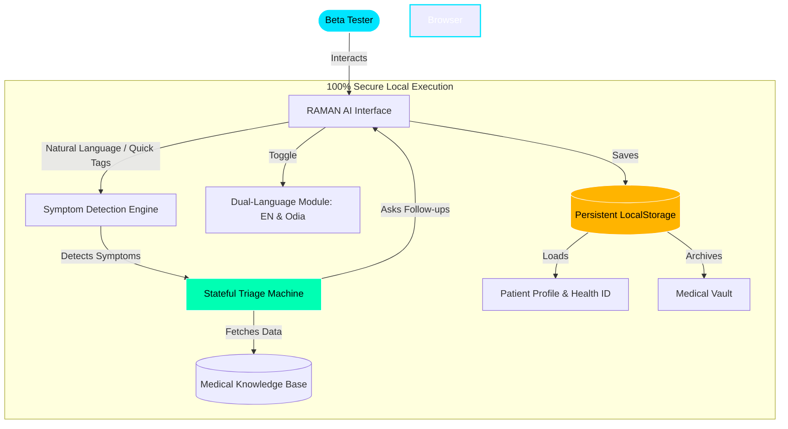

# 🚀 Facebook Post Draft: RAMAN AI Public Beta

Here is a ready-to-publish Facebook post designed to attract both regular users (who want a cool medical assistant) and tech enthusiasts (who will appreciate the privacy and architecture).

***

**[Copy & Paste the text below to Facebook]**

🚀 **Exciting News! Introducing RAMAN AI (Experiment 170) – Your Private, Intelligent Medical Assistant!** 🩺✨

We are thrilled to announce that RAMAN AI is officially moving into **Public Beta Testing**! Built to act as your personal, hyper-intelligent clinical assistant, RAMAN AI is designed from the ground up for privacy, speed, and accuracy.

🌟 **What makes RAMAN AI special?**
✅ **Interactive Diagnostic Engine**: It doesn't just spit out generic web answers. It acts like a real doctor—asking context-aware follow-up questions to understand your symptoms perfectly before offering a comprehensive assessment.
✅ **Bilingual Support (English & Odia)**: Type casually (like *"mora munda bindhuchi"* or *"petare kasta"*) and the AI will instantly detect the symptom, switch languages seamlessly, and guide you in English or Odia!
✅ **100% Local & Private**: No cloud servers reading your medical data. Everything—from your Patient Profile to your Medical Vault—is stored securely right on your own browser. 
✅ **Health ID System**: Finish a consultation and receive a unique Health ID to securely restore your entire medical history in future sessions!

🏗️ **Under the Hood (Architecture):**
We've built a lightning-fast, zero-latency system. Check out the architecture flow in the comments below to see how our locally-run engine works without ever sending your data to the cloud!

🔥 **Join the Beta Today!**
We need YOUR feedback to make RAMAN AI even smarter before the official launch. Click the link below to test it out, try out different symptoms, test the Odia language support, and let us know your thoughts!

👉 **[Link to your Netlify / Hosted Site here]**

#HealthTech #AI #RamanAI #Odia #Innovation #BetaTesting #MedicalTech #PrivacyFirst

***

### 🖼️ Architecture Diagram (For the Comments / Image Attachment)

*You can take a screenshot of this diagram and attach it to your post or put it in the comments to show off the technical side of the project!*

